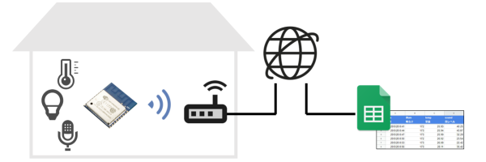
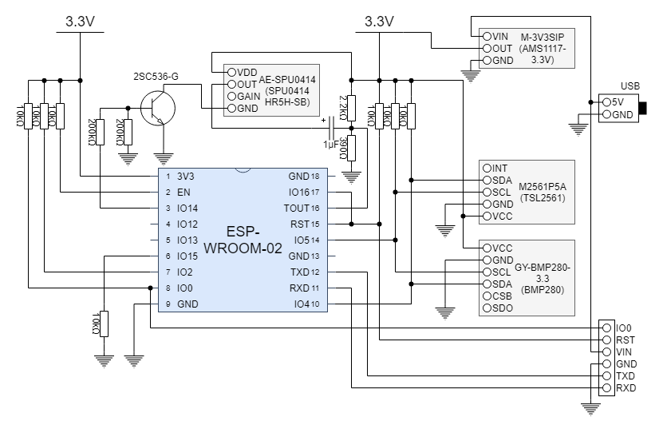
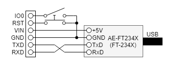
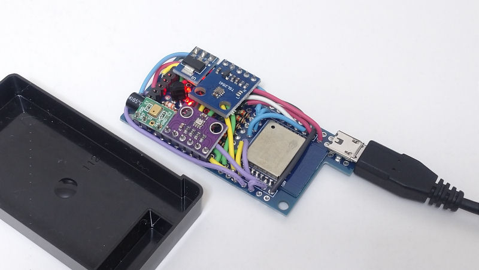

# ESP8266 Living Sensor

## Description

A solution to record indoor environment using Google Sheets and ESP-WROOM-02 with several sensors.



## Recording server

Google Sheets is utilized for recording server.

* Create a new spreadsheet
* Open script editor
  1. Click Tools from the menu bar
  1. Select "Script editor" subitem
* Replace the default script code with the content of ["main.gs"](main.gs) and save
  * You must edit `TOKEN` to random characters for security.
```
const TOKEN = 'xxxxxxxxxxxxxxxxxxxxxxxxxxxxxxxx';
```
* Run `setup()` function
  1. Choose "setup" from the functions drop-down list
  1. Click &#x23F5; icon
* Publish web app
  1. Click Publish from the menu bar
  1. Click "Deploy as a web app..."
  1. Give the project a version number
  1. Set app access to "Anyone, even anonymous"
  1. Click Deploy
      * If prompted, review and authorize permissions.
  1. Copy web app URL from Success prompt

## Sensor device

This device measures the temperature, illuminance and sound level, and upload them to the sever every 3 minutes.

### Hardware

#### Components

* [ESP-WROOM-02](http://akizukidenshi.com/catalog/g/gM-09607/)
* Sensors
  * Temperature sensor: [GY-BMP280-3.3](https://www.aitendo.com/product/15806)
  * Illuminance sensor: [M2561P5A](https://www.aitendo.com/product/17204)
  * Condenser microphone: [AE-SPU0414](http://akizukidenshi.com/catalog/g/gM-08940/)
* LDO module (3.3V): [M-3V3SIP](https://www.aitendo.com/product/13061)
* USB to serial UART module: [AE-FT234X](http://akizukidenshi.com/catalog/g/gM-08461/)
* Resistors
  * 200k&Omega; &times; 2
  * 10k&Omega; &times; 6
  * 2.2k&Omega; &times; 1
  * 390&Omega; &times; 1
* Electrolytic capacitor
  * 1&micro;F &times; 1
* Transistor
  * NPN type, h<sub>FE</sub> 280&ndash;560: [2SC536-G](http://akizukidenshi.com/catalog/g/gI-13824/)
* Wires, connectors, switches, etc...

#### Circuit diagram

Main circuit



Writer circuit



#### Production Example




### Software

#### Build and transfer

Clone the source code and open the project file "ESP8266LivingSensor.ino" with Arduino IDE.

You must import ESP8266 board.

This sketch depends on following libraries. (You can add these by library manager)

* [Adafruit Unified Sensor](https://github.com/adafruit/Adafruit_Sensor)
* [Adafruit TSL2561](https://github.com/adafruit/Adafruit_TSL2561)
* [Adafruit BMP280 Library](https://github.com/adafruit/Adafruit_BMP280_Library)

Also this uses following library.

* [HTTPSRedirect](https://github.com/electronicsguy/ESP8266/tree/master/HTTPSRedirect)

You must modify ["Credentials.h"](Credentials.h) according to your situation.

* `MY_SSID` and `MY_PASSWORD` for your Wi-Fi access point
  * If you assign static IP address to the device, uncomment `#ifdef STATIC_ADDRESS` and edit `staticIP`, `gateway`, `subnet` and `dns`.
* `GAS_PATH` and `GAS_TOKEN` for your recoding server
  * `GAS_PATH` depends on the web app URL.
  * `GAS_TOKEN` must be same as `TOKEN` of web app script.

```
#define MY_SSID     "SSID"
#define MY_PASSWORD "PASSWORD"
//#define STATIC_ADDRESS

#ifdef STATIC_ADDRESS
IPAddress staticIP(192, 168, 1, 100);
IPAddress gateway(192, 168, 1, 1);
IPAddress subnet(255, 255, 255, 0);
IPAddress dns(192, 169, 1, 1);
#endif

#define GAS_HOST    "script.google.com"
#define GAS_PATH    "/macros/s/XXXXXXXXXXXXXXXXXXXXXXXXXXXXXXXXXXXXXXXXXXXXXXXXXXXXXXX/exec"
#define GAS_TOKEN   "xxxxxxxxxxxxxxxxxxxxxxxxxxxxxxxx"
```

You can build the source code with following configuration.

* Board: "Generic ESP8266 Module"
* Builtin Led: "2"
* Upload Speed: "921600"
* CPU Frequency: "160 MHz"
* Crystal Frequency: "26 MHz"
* Flash Size: "4MB (FS:2MB OTA:~1019KB"
* Flash Mode: "QIO (fast)"
* Flash Frequency: "26 MHz"
* Reset Method: "dtr (aka modemcu)"
* Debug port: "Disabled"
* Debug Level: "None"
* lwIP Variant: "v2 IPv6 Higher Bandwidth"
* VTables: "Flash"
* Exceptions: "Legacy (new can return nullptr)"
* Erase Flash: "Only Sketch"
* Espressif FW: "nonos-sdk 2.2.1+119 (191122)"
* SSL Support: "Basic SSL ciphers (lower ROM use)"

Then, you can transfer binary data to ESP-WROOM-02 throungh the writer circuit.

## License


These codes are licensed under [MIT License](LICENSE).
